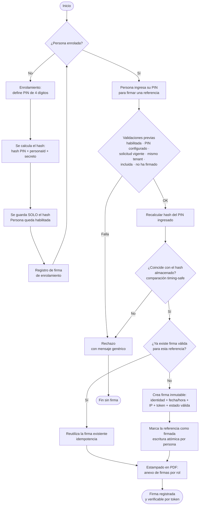

# Proceso de Firma Digital mediante PIN

**Documento técnico-descriptivo para la Dirección**
Preparado para: Subdirección
Ámbito: Plataforma de gestión de seguridad y cumplimiento DS 44 (CChC)

---

## 1. Propósito del documento

Este documento describe, con nivel de detalle suficiente para su revisión por un perfil de ingeniería, el mecanismo de **firma digital mediante PIN** que utiliza la plataforma para dejar constancia legal de que una persona (trabajador, supervisor o relator) ha firmado un documento, una actividad (por ejemplo, una charla de seguridad) o su propio enrolamiento.

El objetivo de este mecanismo es reemplazar la firma manuscrita en papel por un **registro electrónico verificable, único por persona e inmutable**, alineado con los requerimientos de trazabilidad del Decreto Supremo 44.

Se cubren tres aspectos:

1. La **descripción detallada** del proceso, paso a paso.
2. Un **flujograma** que representa el flujo completo.
3. El análisis de **seguridad e integridad**: unicidad del acceso por usuario, protección de la credencial y resguardo de los datos personales.

---

## 2. Conceptos clave

Antes del detalle del flujo, se definen los elementos que intervienen:

| Concepto | Descripción |
|----------|-------------|
| **Persona** | Registro único del trabajador dentro de una empresa (*tenant*). Identificado internamente por un `personaId` irrepetible. |
| **PIN** | Clave numérica de **4 dígitos** que la persona define de forma privada durante su enrolamiento. Es la credencial que autoriza cada firma. |
| **Enrolamiento** | Proceso inicial en el que la persona configura su PIN y queda **habilitada** para firmar. Sin enrolamiento no puede firmar nada. |
| **Hash del PIN** | Representación cifrada e irreversible del PIN. **El PIN nunca se almacena en texto plano**; solo se guarda su hash. |
| **Firma** | Registro que se genera cuando la persona valida su PIN correctamente sobre un documento o actividad. Contiene el firmante, la fecha/hora, el método y la evidencia de auditoría. |
| **Token de firma** | Identificador público y único de cada firma (formato `SIG-…`), pensado para poder verificar la firma posteriormente sin exponer datos sensibles. |
| **Tenant** | La empresa a la que pertenece la persona. El sistema es *multi-empresa*: los datos de una empresa están aislados de los de otra. |

---

## 3. Descripción detallada del proceso

El proceso completo se divide en tres etapas: **enrolamiento** (una sola vez), **firma** (cada vez que se requiere) y **estampado** (materialización legal en el PDF).

### Etapa 1 — Enrolamiento (configuración inicial del PIN)

Ocurre una única vez por persona.

1. La persona ingresa a la plataforma y define un **PIN de 4 dígitos**. El sistema valida el formato: debe ser exactamente 4 caracteres, todos numéricos.
2. El PIN **no se guarda tal cual**. Se transforma en un *hash* mediante un algoritmo criptográfico (SHA-256), combinando el PIN con el identificador único de la persona (`personaId`) y un valor secreto del servidor (*salt*). Es decir, se almacena `hash( PIN + personaId + secreto )`.
   - Como el `personaId` entra en el cálculo, **dos personas con el mismo PIN generan hashes distintos**.
   - Como el proceso es de una sola vía (irreversible), **a partir del hash es imposible reconstruir el PIN**.
3. La persona confirma el PIN para completar el enrolamiento. En ese momento el sistema:
   - Marca a la persona como **habilitada** (`habilitado = true`).
   - Registra una **firma de enrolamiento** con su token, fecha, hora, método (`PIN`) e IP de origen, como primera constancia de que la persona reconoce y controla su credencial.
4. A partir de aquí la persona puede firmar. Si intenta firmar sin estar habilitada, el sistema lo rechaza.

> **Cambio de PIN:** la persona puede actualizar su PIN posteriormente. El sistema exige que el nuevo PIN sea distinto del anterior y, si se entrega el PIN actual, lo valida antes de reemplazar el hash.

### Etapa 2 — Firma de un documento o actividad

Cada vez que se requiere una firma (una charla de seguridad, un procedimiento, un documento del kit DS 44, etc.):

1. **Solicitud de firma.** Existe una referencia a firmar: un documento o una actividad, asociada a la empresa (`tenantId`) y a una obra.
2. **Ingreso del PIN.** La persona introduce su PIN de 4 dígitos en su propia sesión / dispositivo.
3. **Validaciones previas.** El sistema comprueba, en orden:
   - Que la persona **existe**.
   - Que está **habilitada** (completó su enrolamiento).
   - Que **tiene un PIN configurado**.
   - Que la solicitud está **vigente** (no cancelada ni vencida).
   - Que la persona **pertenece a la misma empresa** que la solicitud (aislamiento por *tenant*).
   - Que la persona **está incluida** en la lista de firmantes de esa solicitud.
   - Que **no ha firmado ya** esa misma solicitud.
4. **Verificación del PIN.** El sistema recalcula el hash con el PIN ingresado (`hash( PIN_ingresado + personaId + secreto )`) y lo compara con el hash almacenado, usando una comparación **de tiempo constante** (*timing-safe*) que no revela información por el tiempo de respuesta. Si no coincide, la firma se rechaza sin dar pistas sobre qué parte falló.
5. **Generación de la firma.** Si el PIN es correcto, se crea un registro de firma **inmutable** que contiene:
   - **Identidad del firmante**: `personaId`, RUT, nombre, cargo.
   - **Contexto**: tipo de firma (documento / actividad / enrolamiento), referencia firmada, empresa y obra.
   - **Marca temporal DS 44**: fecha, hora y *timestamp* completo.
   - **Evidencia de auditoría**: dirección IP y *user-agent* del dispositivo.
   - **Token** único de la firma y **método de validación** (`PIN`).
   - **Estado**: `válida`.
6. **Idempotencia.** Si por un reintento de red la misma persona envía dos veces la firma para la misma referencia, el sistema **detecta la firma válida existente y la reutiliza** en lugar de crear un duplicado.
7. **Actualización de la referencia.** La solicitud/documento se marca como firmado para esa persona. Cuando varias personas firman el mismo documento casi al mismo tiempo, cada actualización toca solo su propio registro (escritura atómica por índice), de modo que **las firmas concurrentes no se sobrescriben entre sí**.

### Etapa 3 — Estampado legal en el PDF

Cuando corresponde materializar el documento firmado:

1. Se toma el **PDF original tal como se subió** (que nunca se modifica).
2. Se le agrega un **anexo de páginas** al final con el registro de firmas, **agrupado por rol** (trabajadores, supervisores, relatores, etc.), incluyendo por cada firmante su nombre, RUT, token de firma, fecha y hora.
3. El anexo se **reconstruye completo** a partir del conjunto de firmas vigente, garantizando que el documento estampado siempre refleja el estado real de las firmas.

De esta manera, el PDF resultante es autoexplicativo: contiene el contenido original **más** la evidencia de quién firmó, cuándo y con qué método.

### Verificación posterior

Cualquier firma puede verificarse a posteriori a través de su **token** único, obteniendo el firmante, la referencia, la fecha/hora y el estado. Si se detecta un problema, una firma puede pasar a estado **en disputa** y luego resolverse (mantenerse válida o revocarse), dejando registro de quién y cuándo lo hizo.

---

## 4. Flujograma del proceso

---

## 5. Seguridad e integridad

Esta sección responde a las tres preocupaciones centrales: **acceso único por usuario**, **seguridad de la credencial** e **integridad de los datos personales**.

### 5.1 Acceso e identidad únicos por usuario

- Cada persona posee un identificador interno **único e irrepetible** (`personaId`). Toda firma queda ligada a ese identificador, de modo que **no es posible atribuir una firma a la persona equivocada**.
- El PIN es **personal e intransferible**: solo la persona titular lo conoce, ya que ni siquiera el sistema lo almacena en forma legible.
- Como el `personaId` participa en el cálculo del hash, **dos usuarios que eligieran el mismo PIN tendrían credenciales criptográficamente distintas**. El PIN de una persona nunca sirve para firmar como otra.
- Antes de aceptar una firma, el sistema verifica que la persona **esté habilitada, pertenezca a la empresa correcta y esté explícitamente incluida** como firmante. No hay firmas "genéricas".

### 5.2 Seguridad de la credencial (PIN)

- **Nunca se guarda el PIN en texto plano.** Se almacena únicamente su hash SHA-256, que es **irreversible**: aunque alguien accediera a la base de datos, no podría recuperar el PIN.
- El hash incorpora un **secreto del servidor (*salt*)** además del `personaId`, lo que **impide precalcular tablas de hashes** para adivinar PIN comunes.
- La comparación del PIN se hace con un algoritmo de **tiempo constante** (*timing-safe*), que **evita filtrar información a través del tiempo de respuesta** (ataques de temporización).
- Los mensajes de error ante un PIN incorrecto son **genéricos**: no revelan si el problema fue el PIN, el estado de la persona u otro, dificultando ataques por prueba y error.
- El hash del PIN es un **campo interno**: las respuestas de la plataforma hacia la interfaz **nunca exponen el hash**; solo informan si la persona "tiene PIN configurado" (un simple sí/no).

### 5.3 Integridad y trazabilidad de los datos

- Cada firma es un **registro inmutable**: se crea una vez y no se altera. Su estado solo cambia a través de un flujo controlado y auditado (disputa → resolución).
- El **PDF original nunca se modifica**; la evidencia de firmas se agrega como anexo, preservando el documento tal cual se subió.
- Cada firma guarda **evidencia de auditoría** completa: fecha, hora, *timestamp*, IP de origen y método de validación, lo que permite **reconstruir con precisión quién firmó qué y cuándo**.
- El mecanismo de **idempotencia** garantiza que reintentos o dobles envíos **no generen firmas duplicadas** ni inconsistencias.
- Las **escrituras concurrentes** sobre un mismo documento se realizan de forma **atómica por persona**, de modo que firmas simultáneas de distintos trabajadores no se pisan entre sí.
- Cada firma es **verificable de forma independiente** mediante su token único, sin necesidad de exponer datos personales sensibles.

### 5.4 Aislamiento entre empresas (multi-tenant)

- Todos los datos —personas, firmas, documentos— están **segmentados por empresa (`tenantId`)**.
- Una persona **solo puede firmar solicitudes de su propia empresa**; el sistema rechaza cualquier intento de firmar fuera de su ámbito.
- Las consultas de firmas y disputas **exigen el identificador de empresa**, evitando que una empresa acceda a información de otra.

---

## 6. Resumen ejecutivo

El proceso de firma digital por PIN entrega una constancia electrónica **equivalente y superior a la firma en papel** en términos de trazabilidad:

- **Único por persona**: cada firma está criptográficamente ligada a un identificador irrepetible y a una credencial personal e intransferible.
- **Seguro**: el PIN nunca se almacena legible; se protege con hashing irreversible, *salt* secreto y comparación resistente a ataques.
- **Íntegro**: las firmas son inmutables, auditables, sin duplicados y verificables por token, y el documento original se preserva intacto.
- **Aislado por empresa**: los datos personales de cada empresa permanecen segregados y protegidos.

En conjunto, el mecanismo asegura que **quien firma es quien dice ser, que su credencial está resguardada y que la evidencia resultante es confiable y perdurable en el tiempo.**
